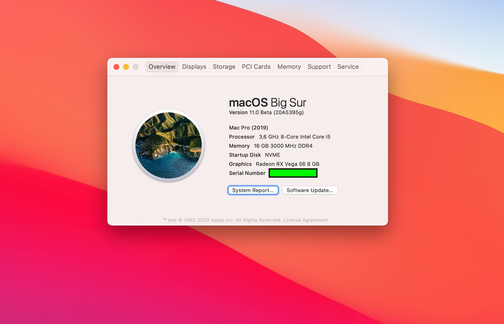

# Hackintosh Catalina Guide for Gigabyte Z390 UD (OpenCore 0.62)

This build is "Big Sur Beta 10". I used [this guide](https://dortania.github.io/OpenCore-Desktop-Guide/) as a starting point.

### Hardware

See my [Hardware List](HARDWARE.md)

### What's Working/What's Not

##### Working
- Ethernet
- Onboard Audio (including digital audio)
- APFS
- Sleep/Wake
- All USB ports at 3.x speed
- iMessage
- App Store
- Facetime
- APFS
- Continuity
- ALL DRMs:
  - iTunes Movies (FairPlay 1.x)
  - Netflix (FairPlay 2.x/3.x)
  - Some Amazon Prime content, but not all. (FairPlay 2.x/3.x)
  - Apple TV+ (FairPlay 4.x)
- Power Nap
- NVRAM

##### Not Yet Tested
- FileVault
- Bluetooth & Wi-Fi
- Handoff
- Airdrop
- AirPlay

### Step By Step Instructions

My old Clover guide used to have Step by Step instructions but I decided not to write such instructions here for two reasons: it's a pain to keep up to date, and I literally just followed the [OpenCore Desktop Guide](https://dortania.github.io/OpenCore-Desktop-Guide/). When in doubt, just look at my KEXTs, drivers and config.list for guidance.

### My EFI

You are welcome to use my EFI folder. However, make sure you set the following:

- SystemSerialNumber
- SystemUUID
- MLB
